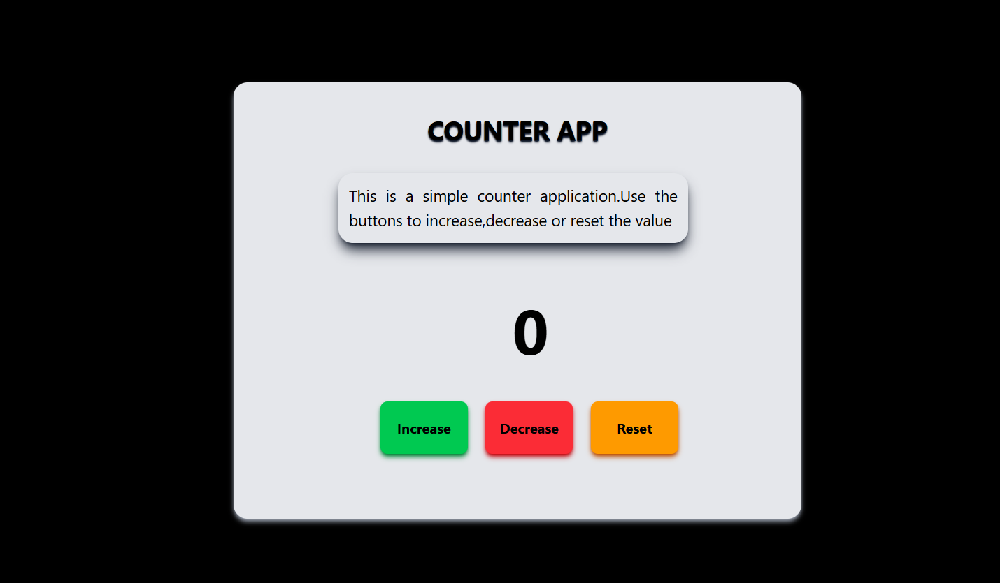

# Counter App 📊

 *[Screenshot placeholder]*

A clean, responsive counter application with smooth animations built with HTML, Tailwind CSS, and JavaScript.

## Features ✨

- ➕ Increment counter
- ➖ Decrement counter
- 🔄 Reset to zero
- 📱 Fully responsive design
- 🎨 Modern UI with shadow effects
- ⚡ Smooth hover animations
- 🔢 Large, clear counter display

## Tech Stack 🛠️


## Installation & Usage 🚀

### Quick Start
1. Clone the repo:
   ```bash
   git clone https://github.com/your-username/counter-app.git
